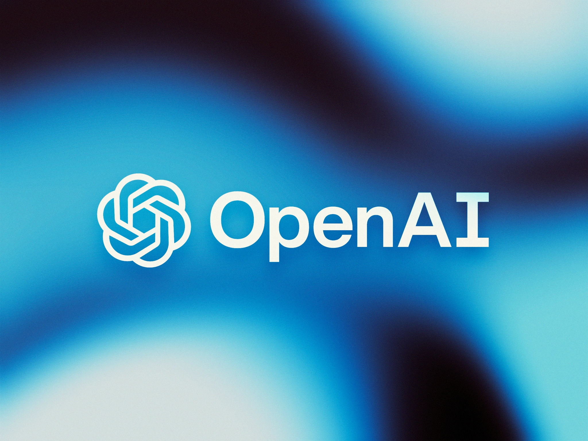

# OpenAI Chatbot



If you are building a chatbot or any other conversational AI application, OpenAI is a great resource to consider. With OpenAI's powerful artificial intelligence technology, you can create chatbots that can understand natural language and generate human-like responses.

## Note

However, there are a few things to note before you start using the OpenAI API for your chatbot. First and foremost, you need to ensure that your OpenAI Credits have not expired. If your credits have been exhausted, your API requests will be denied until you purchase more credits. You can check your credit usage by clicking on the following link.

### `Check Usage:` https://platform.openai.com/account/usage.

Additionally, you need to generate an API Key to make API requests to the OpenAI API. To generate an API Key, click on the following link

### `Get Your Key:` https://platform.openai.com/account/api-keys.

## Setting up Environment variables

To set up this environment variable, you can create a .env file in the root directory of your project and add the following line:

```env
OPENAI_API_KEY=<your-api-key>
```

Replace <your-api-key> with the actual API key that you obtained from the OpenAI website. Make sure to keep this key secure and do not share it with others, as it provides access to your OpenAI account and usage.

## Don't use Axios!

Axios is a popular JavaScript library for making HTTP requests. However, by default, it does not support streaming of HTTP responses.

When a request is made with Axios, it sends the entire request payload to the server and waits for the entire response to be received before returning it as a single response object. This approach works well for small responses, but it can be inefficient and slow for large responses or responses that take a long time to generate.

Streaming, on the other hand, allows the client to start receiving the response as soon as the server starts sending it. This can be much more efficient and faster for large or slow responses because the client can start processing the response before the entire response has been received.

To add support for streaming in Axios, significant modifications would be required to the Axios source code. These modifications would need to include changes to the request and response handling code, as well as changes to the Axios interface and documentation.

In summary, while it is possible to modify Axios to add support for streaming, it would require a significant amount of work and would likely involve modifying the Axios source code directly. If you need to stream responses, it may be easier to use a different HTTP client that already supports streaming, such as fetch() or http.request() in Node.js.
